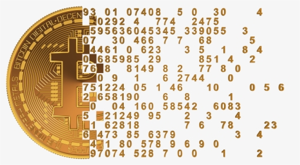

# Bitcoin Farm



Bitcoin Farm is a simple script in Python what test you lucky.  
We are able to understand the number of Bitcoin wallet in the world is equal to:

(964934076977634961863091541739065898773646368992290869855043026179318012451 - 1) * 128 + 127

or

~1,23 * (10 ^ 77)

Reference: <https://allbitcoinprivatekeys.com/>

We have about 10 ^ 23 of sand points in the Earth. A big difference.  
It's more ease find a specific sand point instead a Bitcoin wallet with money.

But if you find any wallet with money, what do you do?
Write your answers in this [issue](https://github.com/raphaelsander/Bitcoin-Farm/issues/2)

---

## To run in Docker container

1 - Create a Bitcoin Farm volume to save the wallet with money and transactions:

```bash
docker volume create bitcoinfarm_volume
```

2 - Build the image

```bash
docker buildx build -t bitcoinfarm --platform=linux/amd64 .
```

*To amd64 platform.*

or

```bash
docker buildx build -t bitcoinfarm --platform=linux/arm/v7 .
```

*To arm32v7 platform.*

3 - Run the container:

3.1 - Linux

```bash
docker run -d \
  --name bitcoinfarm \
  -e PYTHONUNBUFFERED=1 \
  -e WORDLIST="true" \
  -e WORDLIST_PATH="/wordlist/rockyou.txt" \
  -v bitcoinfarm_volume:/usr/src/app/logs \
  -v $(pwd)/wordlist:/wordlist \
  bitcoinfarm
```

3.2 - Windows (CMD)

```cmd
docker run -d ^
  --name bitcoinfarm ^
  -e PYTHONUNBUFFERED=1 ^
  -e WORDLIST="true" ^
  -e WORDLIST_PATH="/wordlist/rockyou.txt" ^
  -v bitcoinfarm_volume:/usr/src/app/logs ^
  -v %CD%\wordlist:/wordlist ^
  bitcoinfarm
```

3.3 - Windows (PowerShell)

```ps1
docker run -d `
  --name bitcoinfarm `
  -e PYTHONUNBUFFERED=1 `
  -e WORDLIST="true" `
  -e WORDLIST_PATH="/wordlist/rockyou.txt" `
  -v bitcoinfarm_volume:/usr/src/app/logs `
  -v ${pwd}/wordlist:/wordlist `
  bitcoinfarm
```
